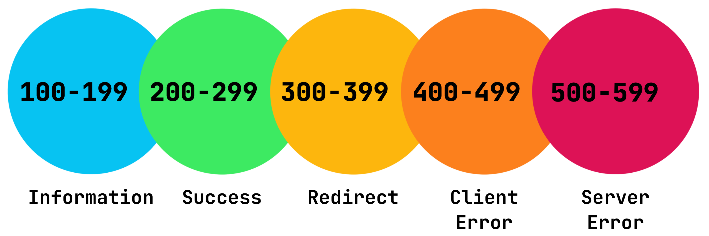
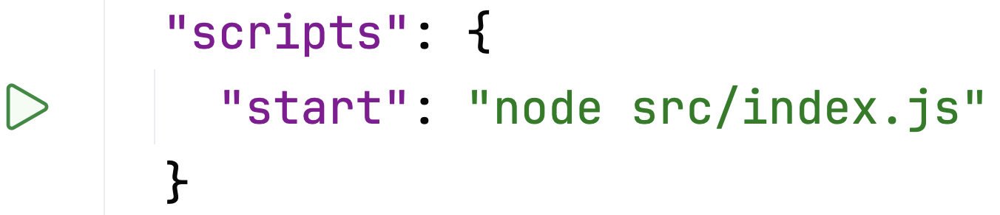
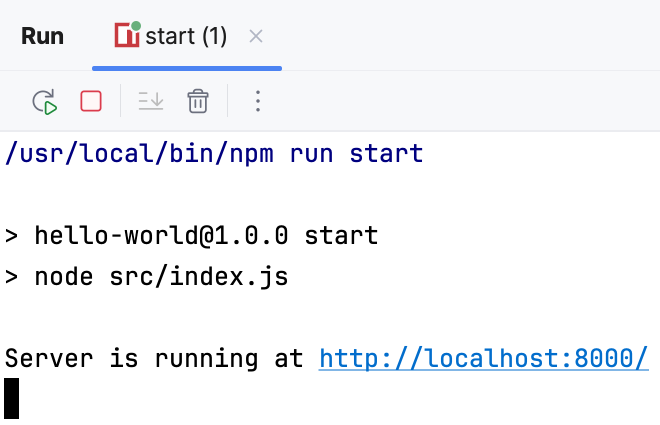

Let's look at the simplest Node.js project. 

```text
.
├── package.json  // project config file
└── src
   └── index.js   // main file 
```
It consists of only two files: the project configuration file,
which contains all the essential information about the project, and a source code file.

---
### index.js
This file is where all the magic of web development happens.

First, we create an HTTP server using the `createServer` method and specify a handler function for all incoming requests.
The handler function's job is to process each new request (`req`) and provide a response (`res`).

In our example, the function checks which [URL](https://en.wikipedia.org/wiki/URL) (Uniform Resource Locator) the request goes to.
For the _route_ `/` (let's call this segment of the URL a _route_), the response header is given a status code of `200`, and the response content type is specified.
Then, the text message `Hello, World!` is added to the response.

For any other URL, the server returns the message `Page Not Found` with the code `404`.

<div style="text-align: center; width:80%; margin: 0 auto; max-width: 900px;">

</div>

HTTP response status codes allow the server to briefly and conveniently report the result of a request to the client.
These codes are standardized: for example, code `200` means "OK", and `404` means "Not Found". 
You don't even need words 🙂.

You can read more about response status codes in the [documentation](https://developer.mozilla.org/en-US/docs/Web/HTTP/Reference/Status).

```js
httpServer.listen(PORT, () => {
    console.log(`Server is running at http://localhost:${PORT}/`);
});
```

The server starts on port `8000` and prints a status message to the terminal.

---
### package.json 
This file serves as the central hub for managing a Node.js application's setup, tools, and required dependencies (libraries/modules).

Take a look at the [package.json](file://Backend/GettingStartedNode/hello_world/package.json) file for this task.
The field names are quite descriptive, so you shouldn't have any trouble understanding them.

The most important section for us right now is `scripts`.
<div style="text-align: center; width:60%; max-width: 500px;">

</div>

Here, we can define specific commands for our Node.js project. 
This is commonly used for tasks like running the project, running tests, or installing dependencies in more complex projects.

---
### Running the project
To run this application, click  next to the `start` script in the IDE interface. 
Alternatively, you can run the project in the terminal by typing the command `npm start`.

You should see an output similar to this:
<div style="text-align: center; width:60%; max-width: 500px;">

</div>

Click on the displayed URL (http://localhost:8000/) to see the `Hello, World!` message right in your browser!
You can also try visiting any other URL, like http://localhost:8000/any, where you'll see the `Page Not Found` message.

🎉 Yay, you've written your first web application. It has a backend that can handle requests from the browser. Doesn't seem too hard, right?

### Stopping the project
Remember to always stop your application when you're done. Click the  button in the tool window at the bottom of your IDE or press `^C` (Ctrl+C).

<style>
img {
  display: inline !important;
}
</style>