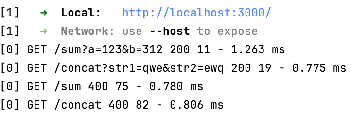

Now it's time to add logger middleware to our project — it will be very useful later.

### Task
Add the [morgan](https://expressjs.com/en/resources/middleware/morgan.html) logging middleware to the project.

You can achieve this in just three simple steps. Once you’ve implemented it, run the application,
try out different routes (with or without the educational frontend), and observe the output.

<div style="text-align: center; width:80%; max-width: 700px;">

</div>

#### 1. Import 
Import `morgan` at the beginning of your file.
```js
import morgan from "morgan";
```

#### 2. Usage
Add the middleware to the application.
```js
app.use(morgan('tiny'));
```

#### 3. Dependencies
In a real project, you'd also need to add any required libraries to `package.json`. In this task, we've already done it for you:
```json
  "dependencies": {
    ...,
    "morgan": "^1.10.0"
  }
```
