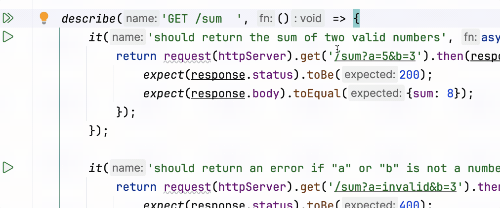

If tests are so useful, let's add them to our project! It only requires a few small changes.

### Test file
In the `backend/__tests__/sum.test.js` file, you can find
a test description for the `/sum` route we created in the previous lesson.

At the beginning of the file, you can find two imports:
- `request` from the `supertest` library, which is used to make HTTP requests to our application's server during testing.
- The `httpServer` object from our application, which will be tested.
  This is why we added `export { httpServer }` at the end of `index.js`.

You will also notice some special methods included in the file that can be useful later.
For example, the `afterAll` method allows us to automatically terminate the web application after testing.
Since web application runs automatically after the `httpServer` import is completed, we don't need to run it explicitly in the `beforeAll`.

Below these imports, there is a nested test suite for testing the `GET /sum` endpoint:
```
describe('GET /sum', () => { ... });
```

Each test case is described like this:
```
it('should return the sum of two valid numbers', async () => { ... });
```

---

### Running tests
You can run all the tests at once by clicking the  button next to the `describe` block, or
you can run a specific test by clicking the  button next to the `it` block.

The output of the tests will appear in the tool window at the bottom of your IDE.
Next to each test, you will see a  or  icon, depending on whether the test passed or failed. 

__Try breaking the `/sum` handler and see how the tests behave!__

<div style="text-align: center; width:100%; max-width: 700px;">

</div>

---

### Project configuration file
As you may have noticed, everything is already configured to work out of the box.
However, this optional step adds some convenience and allows for automated test launching even outside the IDE.

Take a look at the `backend/package.json` file. In addition to the new dependencies, a `jest` block has been added:
```json
  "jest": {
    "testEnvironment": "node",
    "testMatch": ["<rootDir>/__tests__/**/*.test.js"]
  }
```


<a href="https://jestjs.io/">Jest</a> is the testing framework we're using for JavaScript.
Running the tests as shown above, we were already using Jest under the hood.  

In the `backend/package.json` file, we can specify which files will be treated as test files.
This configuration allows you to run all tests in the project at once by clicking the  button.

<div class="hint" title="Path patterns">

  You may notice that the path template for test files in the example above is defined as `"<rootDir>/__tests__/**/*.test.js"`.
  Here’s what each part means:
  - `<rootDir>`: Refers to the root directory where the current `package.json` file is located.
  - `__tests__`: Specifies the folder name.
  - `**/`: Matches any number of intermediate, nested directories.
  - `*.test.js`: Matches all files with the `.test.js` extension.
</div>


<div class="hint" title="Running tests with CLI">

  If you want to run the tests manually in the terminal, navigate to the `backend` directory and execute the following command:
  ```shell
  NODE_OPTIONS="--experimental-vm-modules" npx jest
  ```
  The `--experimental-vm-modules` parameter is [important](https://jestjs.io/docs/ecmascript-modules) because it allows Jest to work with a Node.js project.
  However, while using the IDE's graphical interface in this course, you don’t need to worry about this — we’ve already taken care of this configuration for you. 
</div>

---

### Tests in this course tasks
As you may already know, this course includes auto-checking tasks using tests under the hood.
These tests are implemented in much the same way as the examples you’ve seen, but their source code is hidden from you.

To give you a sense of real-world development practices, most of the test files for future
tasks will be duplicated in the `__tests__` directory.
This way, you can always take a closer look and run them manually if you want to dive deeper into the testing process.

<style>
img {
  display: inline !important;
}
</style>
