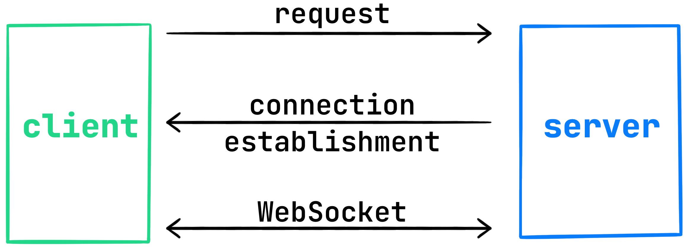

In just a few steps, we have added messaging support to our application – this is already a great result!

However, our application still lacks interactivity.
Currently, we cannot detect when a new message is received, and the only way to retrieve messages is to repeatedly query the `'/api/messages'` route.

In this lesson, you will fix this issue and will learn how to:
- Use WebSocket on the server to send and receive data in real-time.
- Choose the best approach for retrieving messages depending on the use case: WebSocket or a REST API.

### WebSockets
[WebSockets](https://en.wikipedia.org/wiki/WebSocket) allow you to create a two-way interactive communication session between the user's browser and the server.  
Unlike a REST API, where the session ends immediately after the server responds, this type of connection stays active.

We can use this connection for real-time message exchange without constantly polling the server in a loop.
The client will be able to use the same connection for sending messages.

