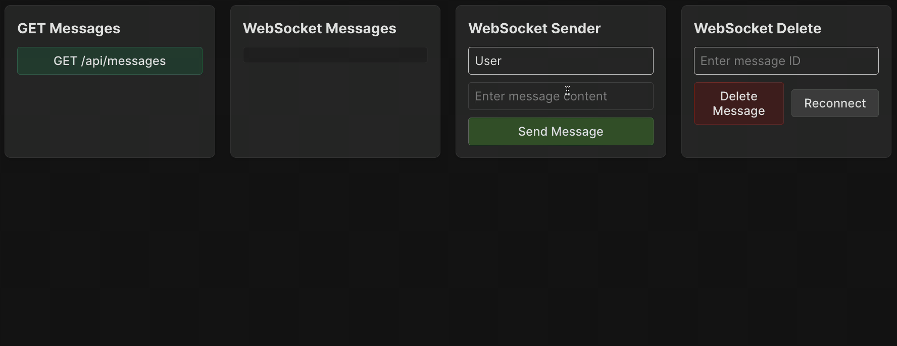

To implement real-time message delivery, we will use the [Socket.IO](https://socket.io/) library.
While it doesn't always use WebSocket under the hood, we don't need to dive into the specifics of its implementation for now.

### Socket.IO
As we learned in the [previous task](course://Backend/WebSockets/lesson_overview), a WebSocket connection can be established between clients and the server. 
For each client, the server creates a `socket` object representing this connection.
But how is communication carried out between the client and the server through the socket?

This is done using an _events_ mechanism.
Events can be thought of as _messages_ with an associated name (_event name_).
Events are defined on both the server and the client, enabling seamless real-time communication.
The server can receive event messages from its clients, send messages back to a specific client, or broadcast them to all connected clients.

The primary task now is to implement event handlers.
In this task, we will use both built-in event names and custom ones.
- **Built-in events**
  - `connection`: Triggered when a new client successfully connects to the server, allowing the server to establish communication with that client.
  - `disconnect`: Triggered when a client disconnects from the server, either intentionally (e.g., by closing the browser) or due to a connection issue.
  - `error`: Triggered when something goes wrong, such as connection issues or unexpected problems.
- **Custom events**
  - `message`: Triggered when a new message appears. This can occur when a client sends a new message to the server, or the server broadcasts it to all connected clients.
  - `deleteMessage`: Triggered when a client requests the deletion of a specific message.
  - `messageDeleted`: Broadcast by the server to notify all connected clients that a message has been deleted.

To simplify project organization,
we have moved the initialization of all event handlers to a separate function `initializeSocketIO` in the file `backend/src/socket.js`.

Use the `socket.on` or `io.on` methods to add an event handler for a specific socket or for all connections, respectively.
The methods `socket.emit` and `io.emit` allow sending event messages to a specific socket or broadcasting them to all connected clients.

### Task
Carefully review the contents of the `backend/src/socket.js` file, paying close attention to its event handlers.

#### `message` event
Implement the handler for processing new messages. To do this:
1. Extract `username` and `content` from the `data` object, which contains the message payload.
2. Add the new message using the message service.
3. Send the message returned by the `addMessage` method to all connected clients using the `io.emit` method with the same event name, `message`.

#### index.js
Next, open the `backend/src/index.js` file.
In this file, you need to create a SocketIO object as follows:
```
const io = new SocketIO(httpServer);
```
Then, pass it to the `initializeSocketIO` function.

### Check yourself
As always, you can rely on the provided tests in `backend/__tests__/socket.test.js` to verify your implementation.
Additionally, the frontend has elements available for sending, deleting, and receiving real-time messages.

Note that since all data handling is performed through the data layer, the `'/api/messages'` route always returns the latest list of messages.

<div style="text-align: center; max-width: 900px; margin: 0 auto;">

</div>

#### `deleteMessage` and `messageDeleted` events (optional)
This task is optional and will not be checked when clicking the `Check` button, so it does not affect course completion.

Implement the handler for deleting a message. To do this:
1. Extract `messageId` from the `data` object.
2. Delete the message using the message service.
3. If no message is found with the given ID, emit an `'error'` event to the current socket with the message `{ message: 'Message not found' }`, and return from the handler method.
4. If the message is successfully deleted, send a `'messageDeleted'` event with  `{ messageId }` to all connected clients using `io.emit`.
