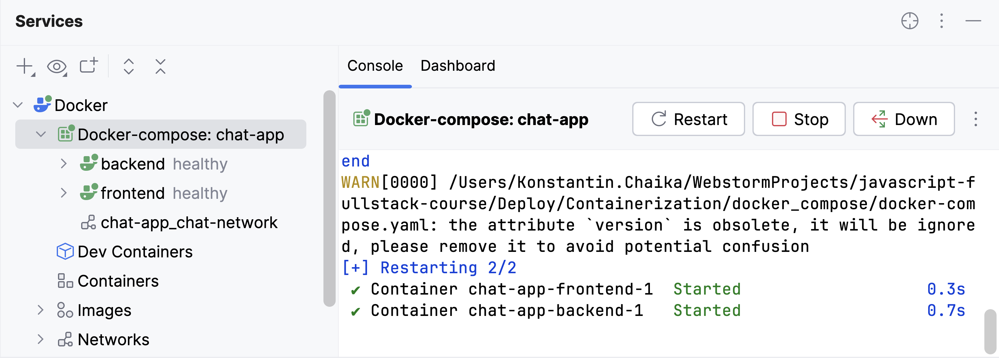

So, we are all set to run both containers with our services.
To simplify their management, we will use [Docker Compose](https://docs.docker.com/compose/).

**Docker Compose** is a tool that allows us to define the deployment of multiple containers.
It also enables targeting each container by its service name.
All we need to do is create a [docker-compose.yaml][docker-compose.yaml] file in our main directory.

### docker-compose.yaml
This file defines two services, with each service having its own container to be built and run.
Let’s look at the most important sections used to describe the services.

- `build`: Specifies the path and name of the Dockerfile used to build the container's image.
- `environment`: Lists the environment variables that should be set inside the container.
- `env_file`: Allows environment variables to be loaded from a file without specifying their values here.
> **Use this approach for secret keys like `JWT_SECRET`.**
> **Also, remember to generate a unique `JWT_SECRET` using the `backend/scripts/generateSecret.js` script.**
- `volumes`: Allows creating persistent storage where data is retained even if the container restarts.
  For example, the volume `chat-db-data` will store the contents of the `'/app/data'` directory inside the backend container.
- `healthcheck`: Defines a command that verifies the health of the service by checking its successful execution.
- `networks`: Ensures that our containers are connected via their own private internal network.
  To access one container from another within this network, you only need to use the service name.
  That’s why we can use a URL like http://backend:8000 inside the frontend container.
- `ports`: Maps a port on your machine to a port inside the container in the format `Host_Port:Container_Port`.

Note that our application is now only accessible via the frontend.
The frontend-backend communication takes place through the internal network. 

You can find more information about Docker Compose in the [official documentation](https://docs.docker.com/compose/).

### Launch the application
To launch both services from the terminal, use the following command:
```shell
docker compose up -d
```
To stop the services, run:
```shell
docker compose down
```

To launch the services in your IDE, click the  button
next to `services` in the `docker-compose.yaml` file.
You can view all relevant information about the launched services in the [Services](tool_window://Services) tool window:

<div style="text-align: center; max-width: 600px; margin: 0 auto;">

</div>

Now you can access the application at http://localhost:3000.

<style>
img {
  display: inline !important;
}
</style>

[docker-compose.yaml]: course://Deploy/Containerization/docker_compose/docker-compose.yaml
