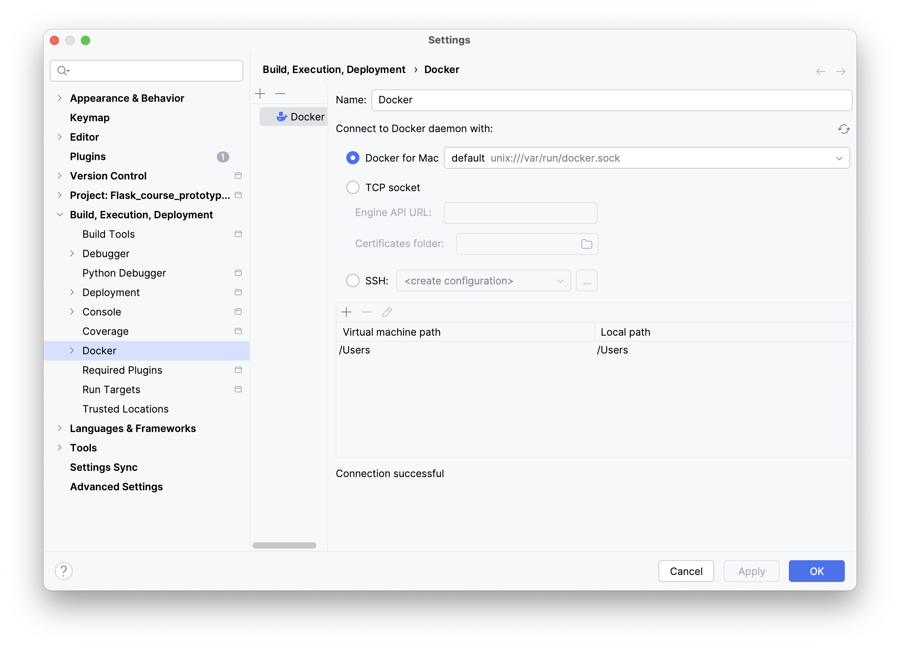
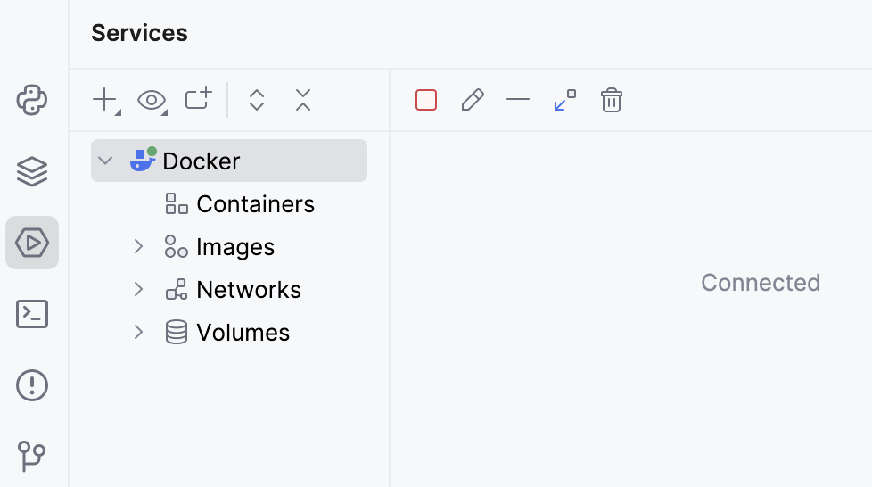

Docker containers provide code isolation, independence, and portability. Docker is essentially needed
if you intend to deploy your application to production. Docker containers are created with fully prescribed
dependencies with which they can be created. These dependencies that are stored, along with the application code,
in the container’s **image**.

A **Dockerfile** is essentially a set of instructions for building a container image, which serves as a blueprint from which your container runs.

In our project, we will use separate containers for the backend and frontend code.

You can read more about Docker in the [Docker documentation](https://docs.docker.com/).

### Docker support in JetBrains IDEs
JetBrains IDEs allow you to manage Docker containers using a graphical interface with just a few simple steps to set up.

### 1. Install and run Docker
For detailed instructions, refer to the [Docker installation guide](https://docs.docker.com/engine/install/) for your specific operating system.

### 2. Configure the Docker daemon connection settings

1. Open the IDE settings (you can use the shortcut &shortcut:ShowSettings;) and select **Build, Execution, Deployment | Docker**.
2. Click  to add a Docker configuration and specify how to connect to the Docker daemon.  
   The connection settings will depend on your Docker version and operating system. For more information, see the [Docker configuration guide](https://www.jetbrains.com/help/pycharm/settings-docker.html).  
   If everything is set up correctly, you should see the **Connection successful** message at the bottom of the dialog.

### 3. Connect to the Docker daemon
The configured Docker connection will appear in the Services tool window (**View | Tool Windows | Services** or use the &shortcut:ActivateServicesToolWindow;). 
Select the Docker node  and click , or select **Connect** from the context menu. Once connected, it should look like this:

To edit the Docker connection settings, select the Docker node and click  on the toolbar, or select **Edit Configuration** from the context menu.

