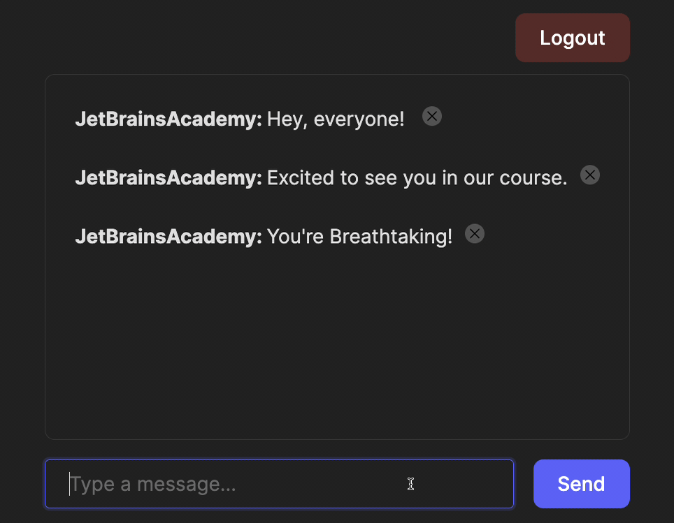

Before starting to implement message deletion, let's break the process into steps.  
Since we will use WebSockets, we need to:

- Create a `handleDelete` method that emits a `deleteMessage` event when a message is deleted.
- Add an interface element to each message that triggers the `handleDelete` method.
- Add a handler for the `messageDeleted` event to remove messages from the list once deletion is confirmed by the backend.

Sounds simple, right? Let’s implement the plan.
In this task, we will also modify only the [Chat.jsx][Chat] file.

### Task
#### A `handleDelete` method
The `handleDelete` function requires the ID of the message to be deleted, so it should accept it as a parameter.
You only need to emit a `deleteMessage` event, passing the `messageId` as an argument:
```jsx
socket?.emit('deleteMessage', { messageId });
```

#### Delete button
The most convenient way for users to delete a message is by clicking a button.
We suggest using the  icon,
located at `'frontend/src/assets/delete.svg'`. 

To do this, add this icon to the `<div>` block for the message. 
When clicked, it will trigger the `handleDelete` method with the message's ID:
```jsx
 handleDelete(message.id)}
    className="delete-button"
/>
```

#### A `messageDeleted` event
Finally, we need to handle the `messageDeleted` event.
Here, you should remove the corresponding message from the `messages` array where the `id` field matches `data.messageId`.
To implement this, use the `'message'` event handler as a reference, or use the following hint:

<div class="hint">

  ```jsx
  setMessages(prev => prev.filter(message => message.id !== data.messageId));
  ```
</div>

### Check yourself
Use the updated tests in the `frontend/__tests__/chat_test.jsx` file to better understand the task and verify your work.

Next, run the application and try deleting a message!

<div style="text-align: center; max-width: 600px; margin: 0 auto;">

</div>

[Chat]: course://Frontend/DeletingMessage/Implementation/frontend/src/pages/Chat.jsx
<style>
img {
  display: inline !important;
}
</style>
