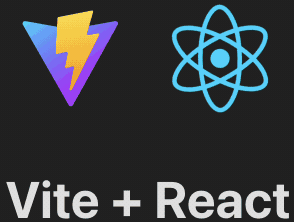

From the very beginning of our course, you have been working with pre-created projects,
allowing you to dive straight into the tasks without being distracted by boring configuration files.
Now it's time to learn how to create a Node.js + React project from scratch, 
just like the one you started this course with.

### Create a project folder
We'll assume that all further actions will be executed from the project directory.
So, let's start by creating it.

### Creating backend
Create the `backend` directory and navigate into it.
Then, run the initialization command:
```shell
npm init -y
```
You can also install Express right away:
```shell
npm install express
```

Next, create a main backend file `src/index.js` with some simple content:
```js
import express from 'express';
import http from 'http';

const app = express();
const httpServer = http.createServer(app);

app.get('/', (req, res) => {
    res.status(200).type('text/plain').send('Hello, World!');
});

const PORT = 8000;

httpServer.listen(PORT, () => {
    console.log(`Server is running at http://localhost:${PORT}/`);
});

export { httpServer, app };
```
Next, add the following to your `package.json` file: the `"type": "module"` property and the `"start": "node src/index.js"` script.

At this point, you should be able to run the backend with the `npm start` command from the `backend` folder.

### Creating frontend
Creating the frontend is much easier thanks to Vite. You don’t even need to manually create the `frontend` directory.
Run the following command from your **project directory**:
```shell
npm create vite@latest
```
Vite will ask you a few questions:
- Enter `frontend` as the project name.
- Choose `React` as the framework.
- Select `JavaScript`.

Next, navigate to the newly created `frontend` directory and run the `npm install` command.

At this point, you should be able to run the frontend with the `npm run dev` command from the `frontend` folder.

<div style="text-align: center; max-width: 500px; margin: 0 auto;">

</div>

### Top-level configuration
Now, all that’s left is to create a common `package.json` file in the project directory:
```json
{
  "name": "my-app",
  "private": true,
  "version": "1.0.0",
  "type": "module",
  "scripts": {
    "start": "concurrently \"cd backend && npm start\" \"cd frontend && npm run dev\""
  },
  "devDependencies": {
    "concurrently": "^8.2.0"
  }
}
```

Run the `npm install` command to install dependencies like `concurrently`.
After that, you can start both the backend and frontend with a single command:
```shell
npm start
```
