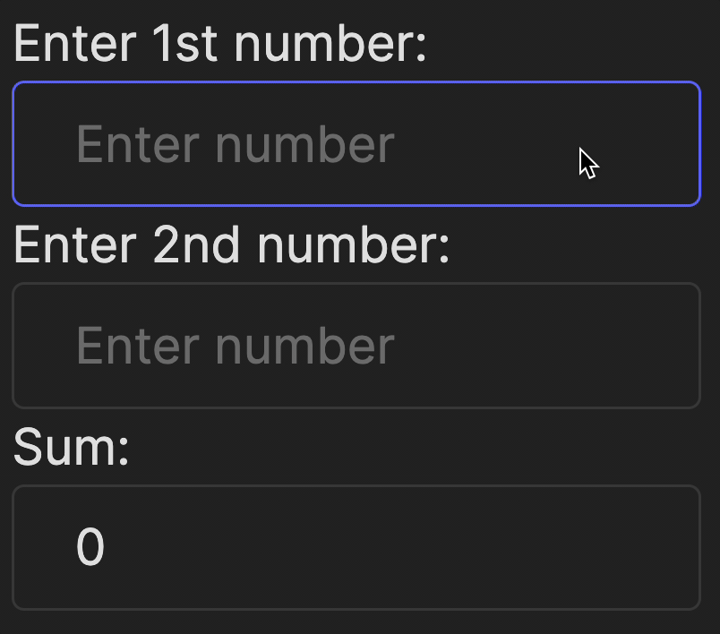

It turns out that beginner programmers, right after writing "Hello world," love to create calculators. Shall we give it a try too?

### Task
Take a look at the file `App.jsx`.
You are given two input fields, `number1` and `number2`, for the user to enter numbers, 
and a `sum` field to display the result of their addition.

Note that using `type="number"` in the input field restricts users from entering non-numeric data.

The program is not yet complete. Your task is to make our simple calculator work:
- Check the `num1` state variable, the `handleNum1Change` function, and the `onChange` event for the first input field. 
  Implement the same functionality for the second input field.
- Update the `value` property of the `sum` field using this expression: `value={+num1 + +num2}`. Adding a plus sign (`+`) before `num1` and `num2` explicitly converts the values to numbers.

As always, use the tests in the `frontend/__tests__/sum_test.jsx` file to better understand the task and verify your solution.

Also, don't forget to manually interact with the application to test it.

