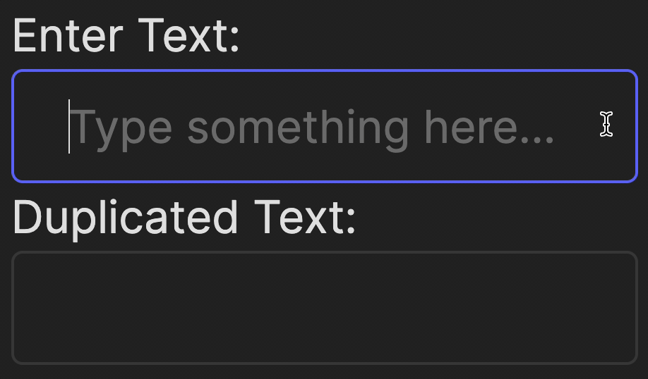
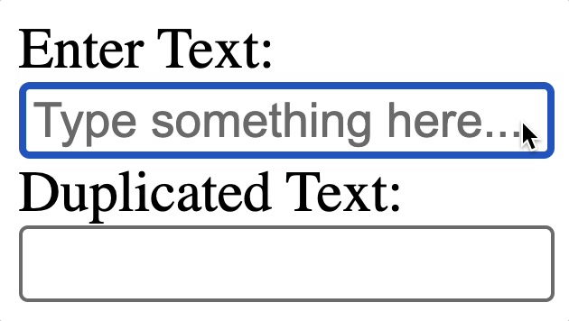

As we [mentioned](course://Frontend/Introduction/tools_libraries) earlier, JSX allows developers to combine HTML, which describes interface components,
and JavaScript, which defines their behavior, into a single file. This makes it more convenient and efficient.

Let's try to learn more about it by building a simple interactive app where 
anything the user types gets immediately duplicated and displayed below.

Look at the `frontend/src/App.jsx` file. The key component is the React _hook_ `useState`, 
which allows us to store and update the value of the text input dynamically:

```js
const [inputValue, setInputValue] = useState("");
```

What is happening here?
- `inputValue` is the state variable that stores the current value of the input field.
- `setInputValue` is the function that updates the `inputValue` state.
- `useState("")` initializes this state with an empty string.

When the user types into the input field, we need to "listen" for the changes and immediately update the state. For this, we define a simple function:

```js
const handleInputChange = (event) => {
    setInputValue(event.target.value);
};
```

Breaking it down:
- Here, `event.target.value` grabs the value the user just typed into the input field.
- `setInputValue` is called to update the `inputValue` state with this new text.

We "attach" this function to the input field using the `onChange` event.

The code in the `src/App.jsx` file defines the fields and labels for entering and displaying duplicate text. 
They have quite telling property names, but let's look at some of them in more detail.

- `htmlFor="..."`: This label's property explicitly indicates which field the label belongs to, which can be useful when writing tests in the future.
- `value={inputValue}`: This ensures that whatever the user types is linked to the `inputValue` state.
- `onChange={handleInputChange}`: This listens for any input changes and instantly updates the state.

Now, run the application and check how it works!

<div style="text-align: center; width:60%; max-width: 300px; margin: 0 auto;">

</div>

Here’s the magic: as soon as you type something into the first field, 
React automatically rerenders the second field to reflect the same value.
This is made possible by the real-time connection between React’s state (`inputValue`) and the UI.

### CSS styles
In this course, we will focus more on what the elements do rather than how they look.
However, the appearance of a web application is just as important. The layout of elements, colors, and other styling can be specified using CSS.
In React applications, there are two ways to apply styles to objects:
- _Traditional method_: Using a `.css` file and applying styles via class names.
- _Inline style_: Specifying styles in the JSX code using the `style` attribute.

You can see both approaches in this project. We are using a `frontend/src/index.css` file and also defining certain properties directly in the `frontend/src/App.jsx` file.

Here's a general rule of thumb: use a `.css` file for styles related to multiple elements or those
that don’t rely on dynamic changes.  
Use inline styles when you need to dynamically change an object’s style based on your application’s logic.

To see how much of a difference appearance makes, try commenting out the line `import './index.css'` in the file `frontend/src/main.jsx` and run the application.  
Without this line, the styles in `index.css` won't be applied.

<div style="text-align: center; width:60%; max-width: 300px;">

</div>