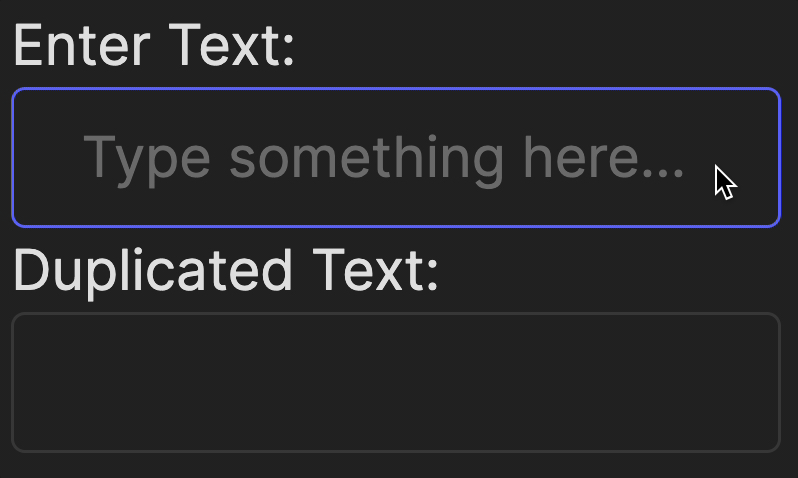

In the first part of the course, we had an [entire lesson](course://Backend/TestingDebugging) about testing and why it is important.
We recommend revisiting that lesson if needed. In this task, we will demonstrate how tests can be used to check the frontend.

Take a look at the file `frontend/__tests__/echo_test.jsx`.
Notice how labels are used to find interface elements.

You can run all the tests at once by clicking the  button next to the `describe` block, or
you can run a specific test by clicking the  button next to the `it` block.

The test output will appear in the tool window at the bottom of your IDE.
Next to each test, you will see a  or  icon, depending on whether the test passed or failed.

Throughout this course, some tasks include automatic validation.
The tests for such tasks are hidden from you but are implemented similarly.
However, you also have access to open tests in the `__tests__` directory,
which you can use to better understand the task or debug it.

### Task
Oh, no, someone broke our program! You already know that, though – you've run the tests, after all.

Fix the program to restore its original behavior. Make sure the tests are working again and click the `Check` button. 

