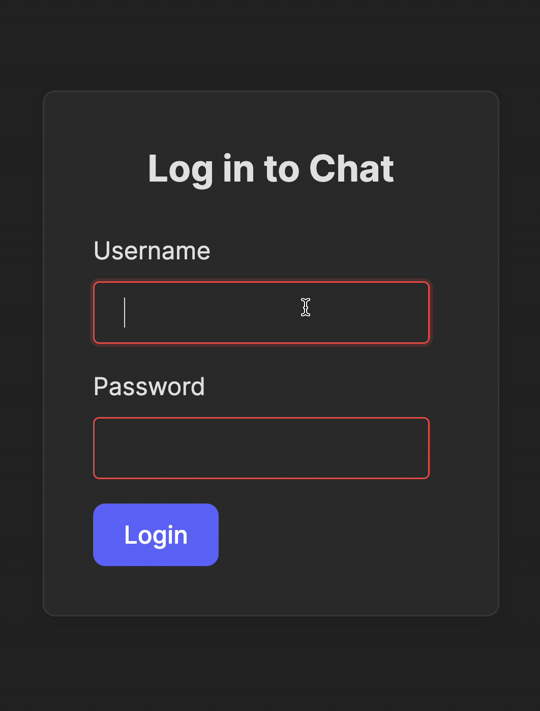

Welcome to the second part of the course, in which you will develop the frontend for your own **Real-Time Chat Application**!

### What you'll learn
By completing this section, you will be able to: 
- Understand the React project file structure and how to run the app.
- Create an app with routing and manage navigation using state.
- Use REST APIs, handle tokens, and add WebSocket-based real-time features.
- Enhance functionality by adding or updating interface components.
- Develop a plan to further improve your application.
