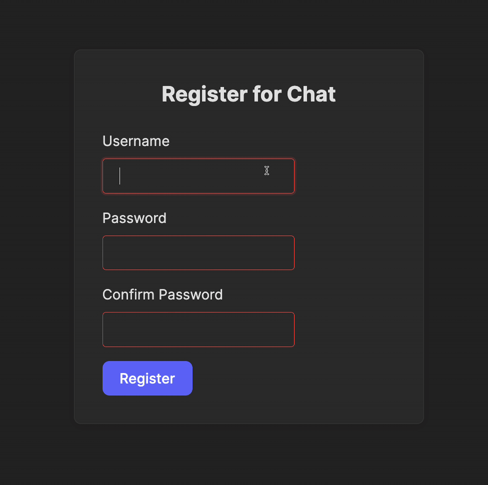
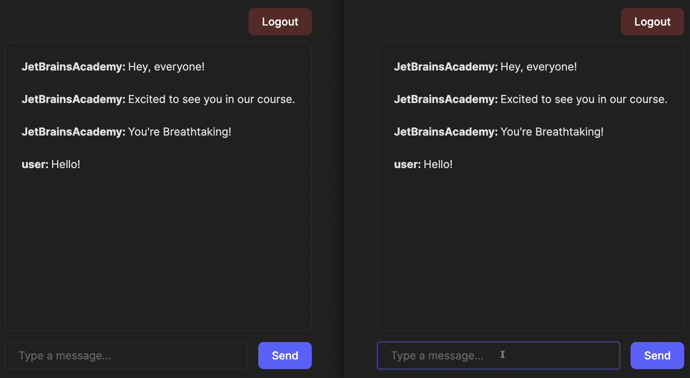

In this task, we will modify only the [Chat.jsx][Chat] file.

The goal is straightforward: in a few steps, we'll add functionality to send and receive messages using WebSockets.

### Task
#### Socket initialization
Initialize the socket within the `useEffect` function. Create the socket object with the authorization token:
```jsx
const newSocket = io('/', {
    auth: {
        token: localStorage.getItem('token')
    }
});
```

Next, define event handlers. At a minimum, add handlers for `"error"` and `"message"`.
- On `"error"`, log the error to the console.
- On `"message"`, append the new message to the existing `messages`:
```jsx
setMessages(prev => [...prev, message]);
```

Finally, save the created socket using the `setSocket` method.

#### Sending a message
For sending messages, we no longer need a REST request. Use the WebSocket `emit` method to send messages like this:
```jsx
socket?.emit('message', { content: newMessage });
```

#### Logout
Since the token is specified during socket initialization, removing it from `localStorage` alone won't stop the socket. 
To handle logging out properly, close the socket in the `handleLogout` function:
```jsx
socket?.close();
```

### Check yourself
Use the updated tests in the `frontend/__tests__/chat_test.jsx` file to better understand the task and verify your work.

Next, run the application and try sending a message to see how great it works!

<div style="text-align: center; max-width: 600px; margin: 0 auto;">

</div>

Moreover, try opening another tab of your chat in a private window (or using another browser) and
check how your chat works with multiple users!

<div style="text-align: center; max-width: 1000px; margin: 0 auto;">

</div>

<div class="hint" title="How does the frontend know where to send requests?">

  You might be wondering how the frontend "knows" where to send REST requests like `'/api/messages'`
  or establish WebSocket connections with the URL `'/'`.
  If you've checked the [vite.config.js][ViteConfig] file, you already know the answer. 
  If not, we'll cover this in the next lesson to avoid distractions for now.

</div>

[Chat]: course://Frontend/WebSockets/web_sockets_support/frontend/src/pages/Chat.jsx
[ViteConfig]: course://Frontend/WebSockets/web_sockets_support/frontend/vite.config.js
