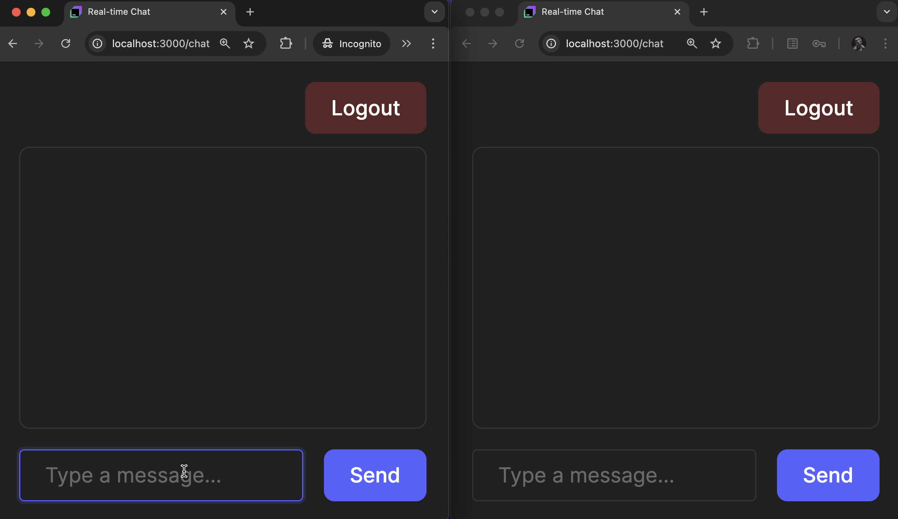

This course is perfect for anyone with a little programming experience who
wants to learn how to write web applications but doesn't know where to start.

### What you’ll build
Step by step, you will create your own **Real-Time Chat Application** with the following features:
  - User authorization
  - Live, instant message updates
  - A simple, shared chatroom for all users

You can add this project to your portfolio, show it to your friends, 
or use it as inspiration to create something entirely new and different!

### Course style
We don't want to overwhelm you with routine programming tasks.
In this course, you'll encounter minimal coding, but it will cover **all stages** of web app development.

You'll get only the essential theory, links to in-depth resources, and practical tasks — nothing unnecessary.

